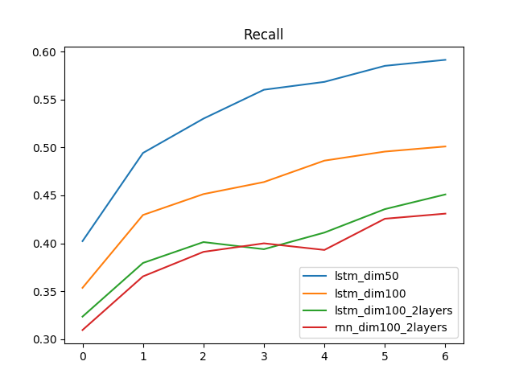
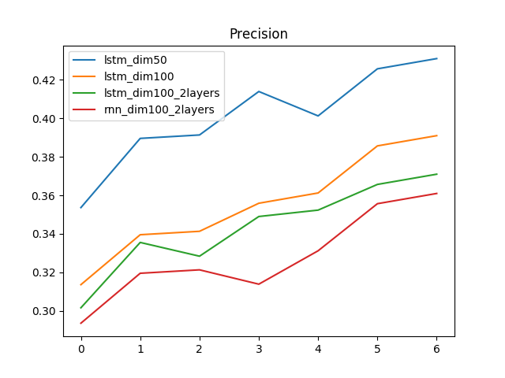
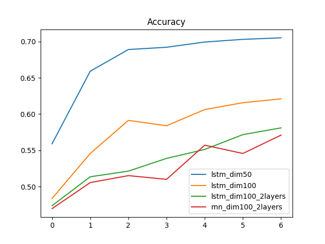
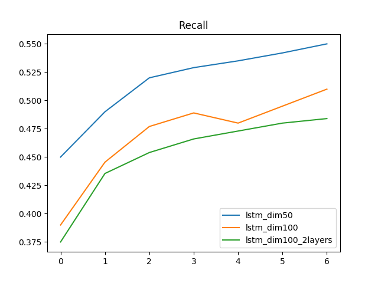
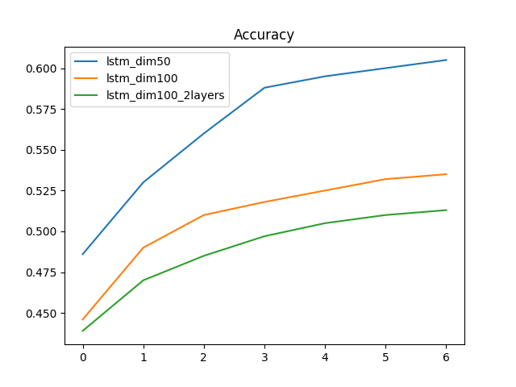

# Sexist Stereotype Classification

## Introduction

  Sexist stereotyping is a social phenomenon described as an over generalization of the attributes, behaviour, characteristics or features of a few people to their entire gender. In recent years, due to the rise in awareness campaigns, both on social media and in form of protests, it has come to light that sexism and sexist stereotyping is quite a common occurrence and it can have far reaching consequences on the victims and therefore must be curbed. The first step in curbing sexist stereotypes is to ask, "what makes a statement or comment sexist?" 

  In this project we turn to Instagram as a source of comments and try to answer the questions from a machine learning perspective: "what features can be extracted that determine that a comment is sexist?" We scrape Instagram captions and comments associated with multiple hashtags and cleaned it up. We annotated the data in a binary fashion (sexist or not), and created an active learning model to annotate the rest of the captions. Our next task is to create a finer classification guidelines and use that to extract some relevant features from the same.

## Dataset

### Collection and preprocessing

  The dataset was curated by scraping instagram posts by hashtags, using this [instagram-scraper](https://github.com/rarcega/instagram-scraper). The hashtags for which we scraped data for were bloodymen, boys, everydaysexism, girls, guys, manspalining, metoo, sexism, sexist and slutshaming.
  We scraped 10,100 posts in total, but some of them had captions just made of emojis and hashtags alone which can not be used, so we removed all such posts. In the end, we were left with captions and comments of 6238 posts. The entire dataset is available in this repository.

### Annotation guideline

The data was annotated based on a simple metric: Do these comments and captions pertain to sexism or not? A comment or caption is defined to pertain to sexism if it is either sexist itself (for example: "Women belong in the kitchen") or about sexism (for example: "I was told to shut up because women don't know science"). This binary classification was manually annotated for 200 captions and comments, with an inter-annotator agreement rate of 94% across four annotators.

Using the annotations, we then further classified the sexist instagram captions and comments based on role based and attribute based sexism. Role based sexism, also known as role stereotyping, refers to the generalization of false notions based on the idea that certain roles, occupations, professions and jobs are restricted only to men, and other are only to women. On the other hand, attribute based sexism or attribute stereotyping,  refers to physiological, psychological or behavioural qualities of men and women, to a degree of generalization that makes it untrue. 

It is also possible that the sexism may be a combination of both. However, due to the data skew on the number of sexist captions and comments, a combination of both would be difficult to identify and isolate, due to which it was not considered.

### Automated Data Annotation

We use a small pool of labeled data, approximately $200$ captions and comments, which are manually annotated. On this, we apply an active learning mechanism, using margin based measures of SVMs measures based on class probability for classification. We calculate the 1-Entropy value, Margin, and MinMax as explained in this [paper](https://www.aclweb.org/anthology/C08-1059.pdf). In each round of AL, we select the ten tokens with the smallest value of the above.

The pipeline for Active Learning is as below:

## Results

| Model                                | Recall | Precision | F1 \-Score | Accuracy |
|--------------------------------------|--------|-----------|------------|----------|
| Single Layer LSTM \(50 dimensions\)  | 0\.59  | 0\.43     | 0\.49      | 0\.70    |
| Single Layer LSTM \(100 dimensions\) | 0\.50  | 0\.39     | 0\.44      | 0\.62    |
| Two Layer LSTM \(100 dimensions\)    | 0\.45  | 0\.36     | 0\.41      | 0\.58    |
| Single Layer RNN \(100 dimensions\)  | 0\.43  | 0\.37     | 0\.39      | 0\.57    |

| Model                                | Recall | Precision | F1 \-Score | Accuracy |
|--------------------------------------|--------|-----------|------------|----------|
| Single Layer LSTM \(50 dimensions\)  | 0\.55  | 0\.49     | 0\.518     | 0\.605   |
| Single Layer LSTM \(100 dimensions\) | 0\.51  | 0\.44     | 0\.472     | 0\.535   |
| Two Layer LSTM \(100 dimensions\)    | 0\.484 | 0\.443    | 0\.462     | 0\.513   |

Recall            |  Precision
:-------------------------:|:-------------------------:
 | 
Accuracy            |  F1-score
 | 

Recall            |  Precision
:-------------------------:|:-------------------------:
 | 
Accuracy            |  F1-score
 | 

## Video

